<h1 align="center">Supernova</h1>
<p align="center">A level editor for <b>Super Mario Galaxy 1 &amp; 2</b>.</p>

<p align="center">
  <a href="https://discord.gg/ZxEqyYeZbf"></a>
  <a href="https://github.com/shibbo/Supernova/actions/workflows/build.yml"></a>
</p>

<p align="center">
  
</p>

> [!NOTE]
> Supernova is in **early alpha**. Crashes and bugs are likely, and there is a real risk of
> losing level progress. Relying on the editor for serious work is **not recommended yet**.
> Keep backups of anything you care about.

Supernova is a level editor for Super Mario Galaxy 1 and Super Mario Galaxy 2, built for editing
objects, cameras, paths, and stage data, with an eye toward eventually previewing levels using
reimplemented game and camera behavior.

- **Written in C#**, using [Dear ImGui](https://github.com/ocornut/imgui) for the interface and OpenGL for rendering.
- **In development since February 2026.**
- **Built from the ground up**. A custom engine for simulating object movement and animation, with rendering written from scratch.
- **Inspired by the Super Mario Galaxy 1 decompilation**. More decompiled game code means more opportunities to simulate the game's own behavior faithfully.
- **Format-accurate**. Yaz0, RARC, and BCSV files are written back 1:1 with the originals.

> The screenshots and clips below show content that is subject to change; the editor is always evolving.

## Features

### Object picking &amp; 3D gizmo

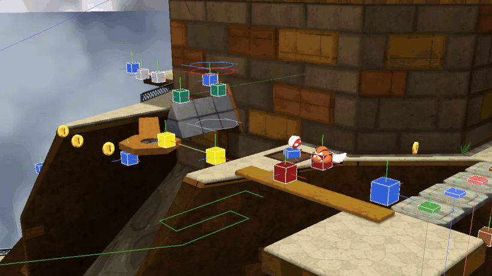

Click to select an object, then move or rotate it on a specific axis with a custom on-screen gizmo.

### Animation &amp; movement playback

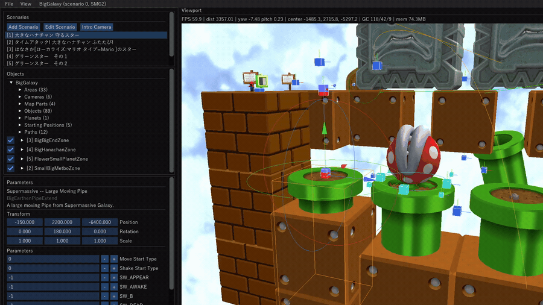

Actors play their real waiting animations (and other applicable animations) right in the editor. Object movement along rails and rotation simulates live in the viewport.

### Custom property editors

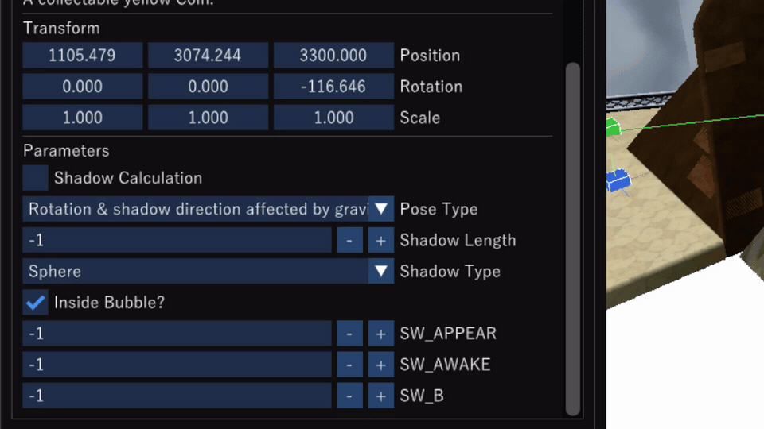

Every object type gets its own editor for its parameters, not just raw fields. Booleans
become checkboxes, list values become dropdowns, and `Obj_arg` descriptions show up as
tooltips so developers can identify what each argument does. The data comes from the Luma's
Workshop Object Database, and the same treatment applies to `path_arg` and `point_arg`.

### Map Parts simulation

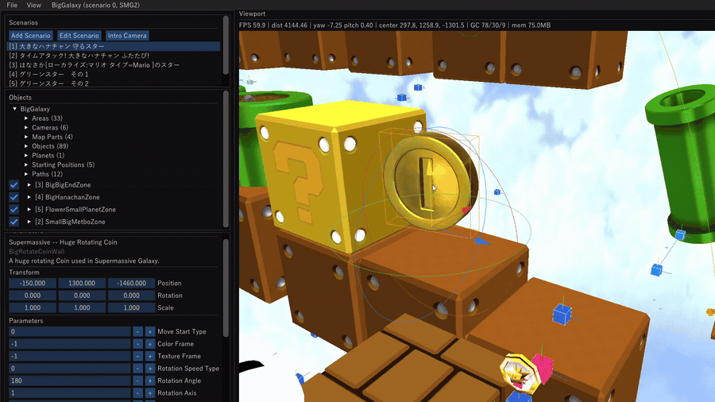

Rotating and moving map parts simulate live in the viewport as you tune their parameters.
Supports `RailMoveObj` and `RotateMoveObj`, with more planned before release.

### Camera editor &amp; visualization

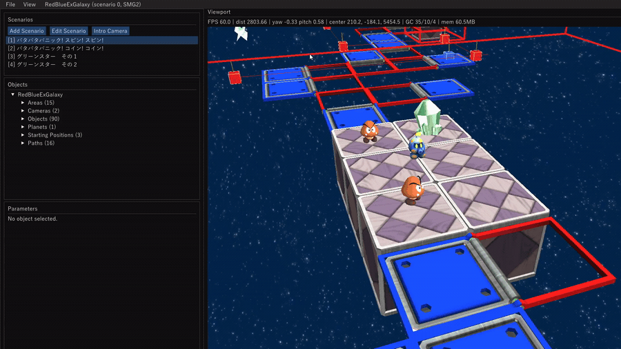

Edit stage cameras and visualize specific camera types...including `CAM_TYPE_XZ_PARA`, right in
the editor. Place a dummy player to see how the camera would react. Many more camera types are
planned.

### Intro camera editor

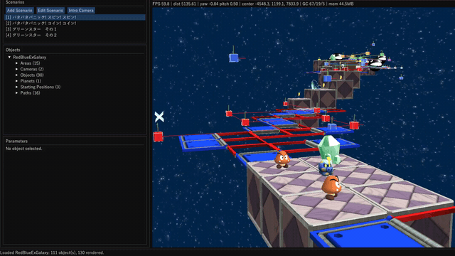

Edit a galaxy's intro camera keyframe by keyframe and preview the result live in the viewport.

### Scenario editor

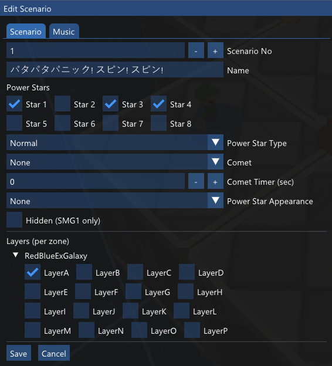

Edit a galaxy's scenarios: power stars, comets, and per-zone layers without leaving the editor.
It also supports adding *new* stars and layers.

### Demo (cutscene) editor

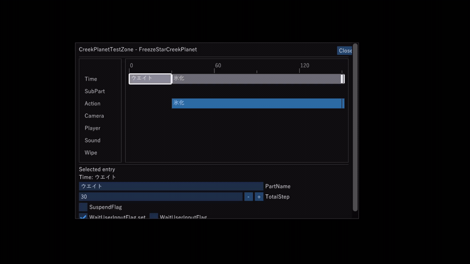

Timeline editing for demo cutscenes.

### Project system


Make your own edits while never touching the retail filesystem. Each project keeps its own output directory and icon, so retail files stay untouched.

### Lighting

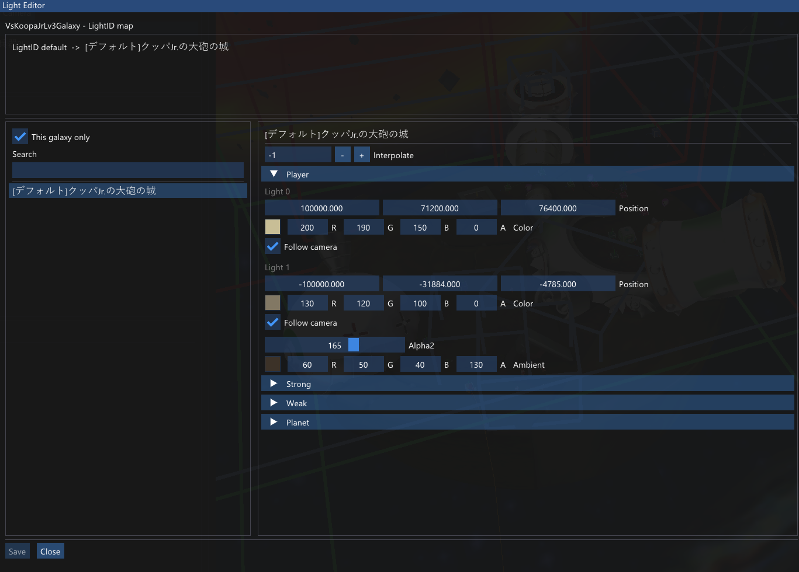

Render and edit `LightData`, and apply it to the level (including an "auto" mode).

### Stage music

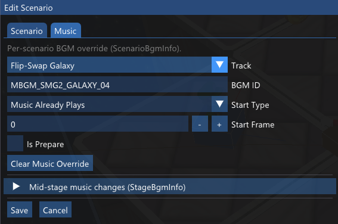

Edit a galaxy's stage BGM.

### ProductMapObjDataTable

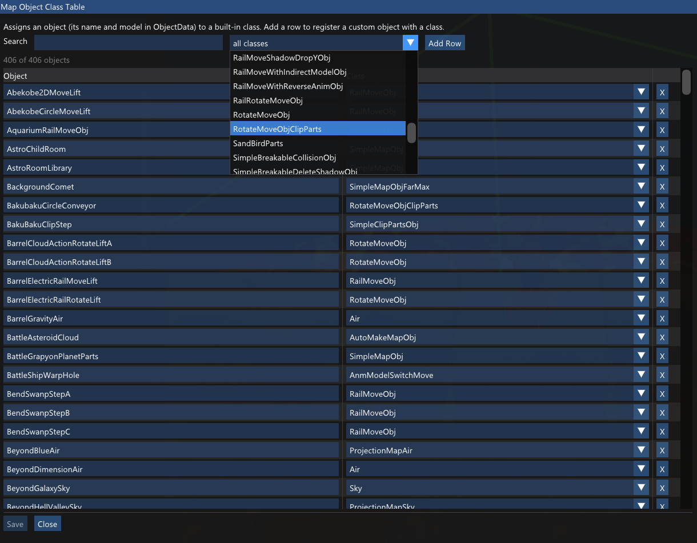

Edit `ProductMapObjDataTable` with a helper that lists known objects.

## Planned

- User-created themes
- `Obj_arg` visualizers (e.g. range values)
- More per-object rendering
- More camera types and Map Parts behaviors

## Building

Requires the [.NET 8 SDK](https://dotnet.microsoft.com/download). The editor currently targets
`net8.0-windows`.

```sh
git clone https://github.com/SMGCommunity/Supernova.git
cd Supernova
dotnet build SMGEditor.sln -c Release
dotnet run --project src/SMGEditor.Editor
```

You will need your own legally obtained Super Mario Galaxy 1 / 2 files. Point the editor at an extracted game dump and it will automatically determine the game.

## Community

Questions, help, and discussion happen in the **[Luma's Workshop Discord](https://discord.gg/ZxEqyYeZbf)**.

## Credits

- The [Luma's Workshop](https://discord.gg/ZxEqyYeZbf) Object Database
- The Super Mario Galaxy decompilation project (Petari)
